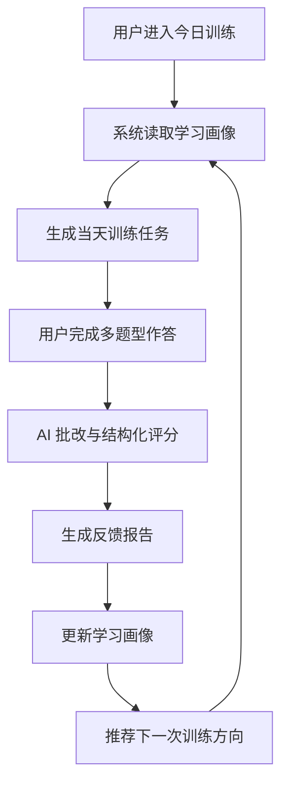
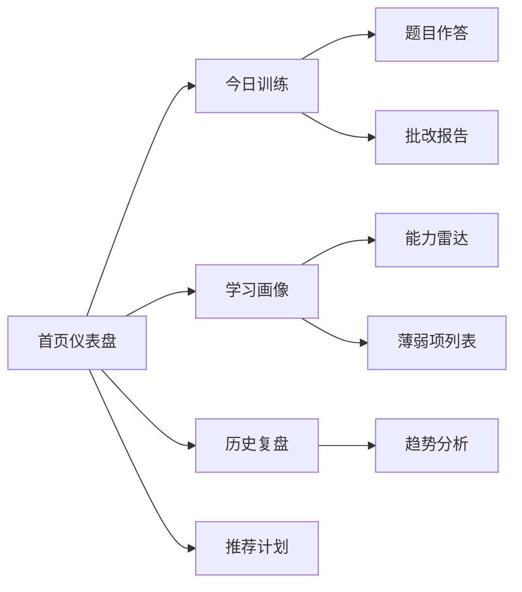

# AI Work Coach 项目介绍
项目仓库：https://github.com/LBP97541135/ai-work-coach
AI Work Coach 是一个面向个人职业成长的 AI 学习教练产品。它不是简单的刷题工具，而是围绕“每日训练 - AI 批改 - 能力画像 - 自适应推荐”构建长期成长闭环，帮助用户持续提升 Agent、工程和产品能力。
## 1. 项目目标
这个项目希望解决一个很具体的问题：个人成长往往依赖零散学习、临时复盘和主观判断，缺少一个能持续记录表现、识别短板、动态调整训练内容的系统。
AI Work Coach 的目标是让用户每天完成一组轻量训练，并通过 AI 批改得到结构化反馈。系统会把每次训练结果沉淀到学习画像中，再生成下一轮更适合用户当前状态的训练内容。
## 2. 用户场景
目标用户是希望提升 AI 产品、Agent 工程、软件架构和产品经理能力的个人学习者。
典型场景包括：
- 每天花 10-20 分钟完成一次职业能力训练
- 针对 Agent 开发、产品设计、工程架构等主题进行专项练习
- 获得比“答案对错”更细的结构化反馈
- 看见自己的能力变化，而不是只保存一堆历史记录
- 根据薄弱项自动生成下一次训练任务
## 3. 核心功能
### 今日训练
系统根据用户画像生成当天训练，包括选择题、分析题、方案设计题和复盘题。训练内容不是固定题库，而是围绕用户当前短板和近期目标动态调整。
### AI 批改
用户提交答案后，AI 会从准确性、结构化表达、业务理解、工程可行性和产品判断等维度给出评分与建议。
### 学习画像
系统持续维护用户在不同能力维度上的表现，例如 Agent 设计、产品拆解、工程实现、数据分析、表达结构等。画像不是静态标签，而是会随着训练结果不断更新。
### 自适应推荐
根据画像变化，系统推荐下一次训练主题、复习内容和补强方向，让用户的成长路径更加连续。
### 历史复盘
用户可以查看历史训练记录、能力趋势、常见问题和阶段性进步，形成可视化成长档案。
## 4. 产品亮点
- **从训练到画像的闭环**：不是一次性问答，而是把每次答题结果沉淀为长期画像。
- **面向真实职业能力**：题目围绕产品判断、工程落地、Agent 系统设计等实际能力展开。
- **反馈结构化**：批改结果不仅给分，还拆解优点、问题、改进建议和下一步任务。
- **自适应学习路径**：训练内容会根据用户表现变化，而不是所有人走同一套课程。
- **适合做作品集展示**：页面能同时体现产品设计、数据建模和前端交互能力。
## 5. 技术与工程亮点
项目前端用纯 mock 数据模拟完整产品闭环，重点不在真实调用模型，而在展示一个 AI 教练产品应该如何组织状态、流程和数据结构。
工程上重点包括：
- 用户训练状态管理
- 多题型答题交互
- AI 批改结果结构化展示
- 学习画像可视化
- 推荐逻辑 mock
- 历史记录与趋势面板
- 后续接入真实 AI Provider 的接口预留
## 6. 核心流程图

## 7. 信息架构

## 8. 我在项目中的角色
我负责将项目从“AI 学习工具”重新组织成一个完整的产品体验：定义用户成长闭环、拆分页面结构、设计 mock 数据、梳理状态流转，并完成前端展示的产品化表达。
这个项目体现的是我对 AI 产品的一个判断：真正有价值的 AI 工具不应该只完成一次回答，而应该能持续理解用户、记录变化，并把下一次交互变得更准确。
## 9. 展示入口
- Mock 产品页：`labs/ai-work-coach/`
- 项目介绍页：`docs/projects/ai-work-coach.html`
