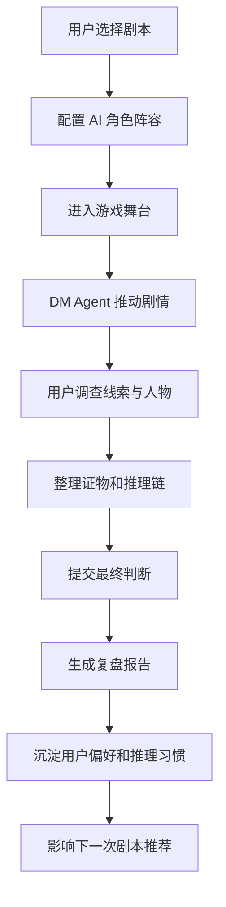
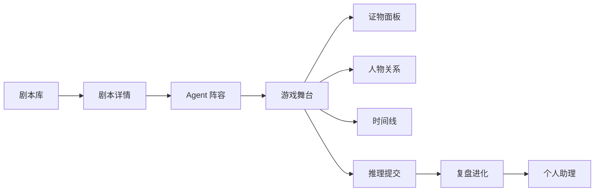

# 进化酒馆项目介绍
项目仓库：https://github.com/LBP97541135/evo-murder-game
进化酒馆是一个 AI 剧本杀互动产品原型。它把剧本库、DM Agent、角色陪玩、证物推理、长期记忆和行为进化组合在一起，尝试让“单人也能玩剧本杀”变成一个完整的 AI 互动叙事体验。
## 1. 项目目标
传统剧本杀高度依赖真人 DM、玩家人数和现场配合。对于单人用户来说，想随时进入一个有沉浸感、有推理、有陪伴感的剧本体验并不容易。
进化酒馆的目标是让 AI 角色承担 DM、玩家、陪玩和复盘教练等职责，使用户可以随时开启一场可互动、可推理、可复盘、可长期进化的剧本杀体验。
## 2. 用户场景
目标用户是喜欢推理、角色扮演、AI 陪伴和互动叙事的玩家。
典型场景包括：
- 一个人想体验剧本杀，但没有固定玩家局
- 希望 AI DM 能推动剧情、给出提示、控制节奏
- 希望 AI 角色具备不同性格和立场，而不是统一口吻
- 希望系统记住自己的推理习惯和偏好
- 希望每次复盘后，下一次体验更贴合自己
## 3. 核心功能
### 剧本库
用户可以浏览不同类型的剧本，包括悬疑、情感、科幻、古风等题材。每个剧本拥有难度、时长、人数、核心机制和剧情标签。
### Agent 阵容
系统为每个剧本配置不同 AI 角色，包括 DM、NPC、嫌疑人、陪玩角色和复盘助手。不同角色有独立人设、目标、知识边界和表达风格。
### 游戏舞台
用户进入剧本后，通过对话、选择、调查和推理推进剧情。DM Agent 负责场景切换、线索发放、节奏控制和关键提示。
### 证物推理
系统展示证物、人物关系、时间线和矛盾点，帮助用户把碎片化线索整理成推理链。
### 复盘进化
每次游戏结束后，系统分析用户的推理习惯、提问方式、偏好类型和薄弱点，并沉淀为长期记忆。
### 个人助理
个人助理负责跨剧本记录用户偏好，为下一次推荐剧本、角色陪玩风格和提示强度。
## 4. 产品亮点
- **单人剧本杀体验**：让用户不依赖真人组局，也能进入完整互动叙事。
- **DM Agent 控场**：AI 不只是聊天，而是承担节奏、规则、线索和提示管理。
- **角色差异化**：不同 Agent 有不同身份、立场和表达方式，增强沉浸感。
- **推理链可视化**：把证物、人物关系、时间线和疑点组织成可理解结构。
- **长期进化**：复盘结果会影响后续剧本推荐和陪玩策略。
## 5. 技术与工程亮点
这个项目的核心工程挑战不是单页展示，而是如何用前端 mock 表现一个复杂 AI 叙事系统的完整状态。
工程上重点包括：
- 剧本数据建模
- Agent 角色与人设配置
- 游戏阶段状态机
- 对话与线索联动
- 证物、人物、时间线的数据组织
- 复盘报告与长期记忆 mock
- 多页面之间的状态一致性
## 6. 核心流程图

## 7. 信息架构

## 8. 我在项目中的角色
我负责将剧本杀项目从“AI 对话 Demo”升级为一个产品化互动系统：重新梳理功能层级，设计用户从选剧本到复盘进化的完整路径，并用 mock 前端展示产品最终形态。
这个项目体现的是我对 AI 互动产品的理解：AI 陪伴不应该只是回答用户，而应该参与剧情、维持世界观、理解用户偏好，并在一次次体验中变得更贴合用户。
## 9. 展示入口
- Mock 产品页：`labs/evo-murder-game/`
- 项目介绍页：`docs/projects/evo-murder-game.html`
