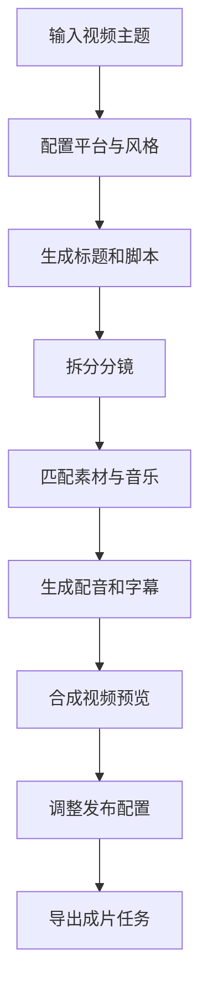
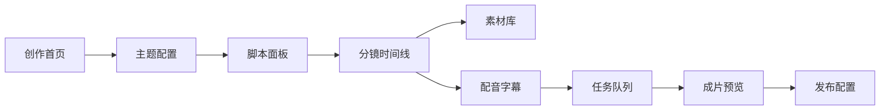

# MoneyPrinterTurbo 项目介绍
项目仓库：https://github.com/LBP97541135/MoneyPrinterTurbo
MoneyPrinterTurbo 是一个 AI 短视频自动生成工作台。它围绕“从一个主题到一条可发布短视频”的生产链路，展示选题、脚本、素材、配音、字幕、剪辑和发布配置如何被组织成可视化流水线。
## 1. 项目目标
短视频生产不是单点生成问题，而是一条复杂链路：用户要确定主题、生成脚本、匹配素材、配置声音、生成字幕、预览成片，并根据平台要求调整发布信息。
MoneyPrinterTurbo 的目标是把这条链路产品化，让创作者可以用一个工作台理解每一步输入、生成进度、结果质量和可调参数。
## 2. 用户场景
目标用户是短视频创作者、内容运营、营销人员和希望批量生产内容的个人用户。
典型场景包括：
- 输入一个主题，快速生成短视频方案
- 选择内容风格、目标平台和受众
- 自动生成脚本、分镜和字幕
- 匹配素材、配音和背景音乐
- 查看生成进度和任务状态
- 预览成片并调整发布配置
## 3. 核心功能
### 选题与配置
用户输入主题、关键词、目标平台、视频时长、语言风格和受众定位，系统生成内容任务。
### 脚本生成
系统根据主题生成标题、开头钩子、分段脚本、画面建议和结尾行动引导。
### 素材编排
系统将脚本拆分成镜头片段，并为每段匹配素材、转场、背景音乐和画面节奏。
### 配音与字幕
用户可以选择声音风格、语速、字幕样式和语言，系统模拟生成配音与字幕轨道。
### 任务队列
生成过程以任务队列形式展示，包括脚本生成、素材检索、音频合成、字幕渲染和成片导出。
### 成片预览
用户可以查看最终视频结构、分镜时间线、字幕轨道和发布信息。
## 4. 产品亮点
- **完整内容生产链路**：从主题到成片，不只展示一个生成按钮。
- **流水线可视化**：用户可以看见每一步生成状态和结果。
- **创作者可控**：保留风格、平台、时长、声音、字幕等关键配置。
- **任务状态清晰**：生成进度、风险提示和结果预览集中展示。
- **适合作品集呈现**：能直观体现 AI 内容工具的产品设计和前端表达能力。
## 5. 技术与工程亮点
项目用纯前端 mock 模拟 AI 内容生成流水线，重点展示复杂任务如何被拆解、排队、展示和复盘。
工程上重点包括：
- 多步骤任务状态机
- 视频生成流程可视化
- 素材库与分镜数据结构
- 字幕、配音、时间线 mock
- 任务队列与进度反馈
- 成片预览与配置面板
- 无后端场景下的完整演示体验
## 6. 核心流程图

## 7. 信息架构

## 8. 我在项目中的角色
我负责把 MoneyPrinterTurbo 重新整理成适合作品集展示的 AI 内容生产工作台：梳理生成链路，设计 mock 页面结构，突出任务状态、创作者控制感和最终成片预览。
这个项目体现的是我对 AI 内容工具的理解：好的生成产品不应该只告诉用户“生成中”，而应该把复杂生产过程拆成可理解、可调整、可判断的流程。
## 9. 展示入口
- Mock 产品页：`labs/money-printer-turbo/`
- 项目介绍页：`docs/projects/money-printer-turbo.html`
