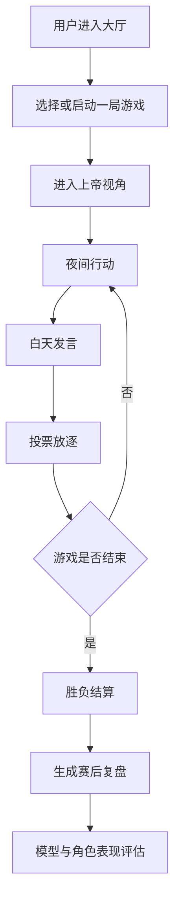
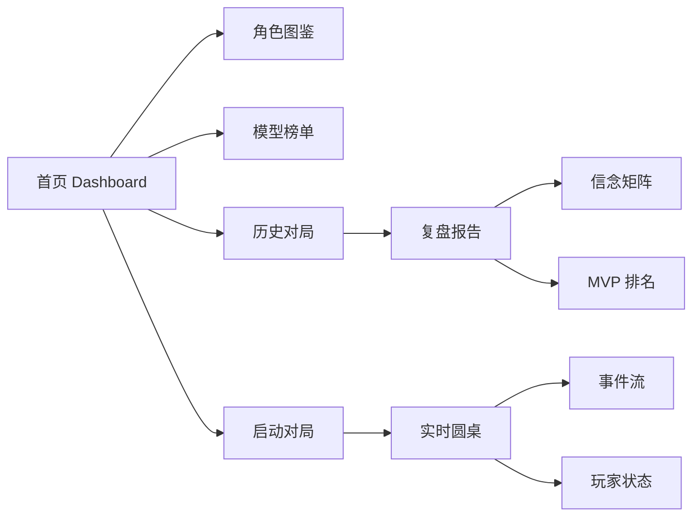

# AI 狼人杀项目介绍

项目仓库：https://github.com/kissie-77/MultiAgent-Werewolf

AI 狼人杀是一个多智能体博弈系统。它利用狼人杀天然的信息不对称、阵营协作、发言说服和投票机制，展示多个 AI Agent 如何在复杂规则下进行推理、协作、欺骗和复盘。

## 1. 项目目标

很多多智能体 Demo 停留在“多个角色轮流聊天”，但缺少真实规则约束、信息隔离和结果评估。

AI 狼人杀的目标是把多智能体能力放进一个高压博弈环境中验证：每个 Agent 有不同身份、私有信息、行动权限和胜利目标，它们需要在对局中持续判断、发言、投票和调整策略。

## 2. 用户场景

目标用户包括 AI 产品观察者、Agent 开发者、游戏 AI 爱好者和希望了解多智能体协作机制的访问者。

典型场景包括：

- 观察 AI 角色如何在狼人杀中发言和投票
- 对比不同模型在推理、欺骗和协作上的表现
- 查看信念矩阵如何随发言变化
- 复盘一局游戏中的关键转折
- 理解多智能体系统如何做信息隔离和事件记录

## 3. 核心功能

### 对局大厅

用户可以查看历史对局、快速启动 mock 对局，并进入上帝视角观察实时状态。

### 角色系统

系统包含狼人、村民、预言家、女巫、猎人等角色。不同角色拥有不同阵营、技能和信息边界。

### 实时对局

页面展示昼夜阶段切换、玩家发言、夜间行动、投票结果、死亡状态和胜负结算。

### 信念矩阵

系统展示各角色对其他玩家身份的判断概率，让访问者看见 AI 的推理过程如何变化。

### 模型表现

页面展示不同模型或角色在历史对局中的胜率、MVP、推理表现和行为特点。

### 赛后复盘

游戏结束后，系统展示时间线、关键事件、MVP 排名、阵营胜负和策略分析。

## 4. 产品亮点

- **真实博弈规则**：狼人杀比普通聊天更能检验多智能体能力。
- **信息隔离明确**：狼人、神职、平民拥有不同可见信息。
- **推理过程可视化**：信念矩阵让“AI 怎么想”更可解释。
- **实时事件流**：用户能看见游戏阶段、发言、投票和死亡变化。
- **赛后评测闭环**：不是只展示过程，还通过复盘评估 Agent 表现。

## 5. 技术与工程亮点

当前作品集版本保留原有 React 前端，通过本地 mock 数据替换后端 API 和 SSE，让页面在无后端情况下完整展示产品功能。

工程上重点包括：

- API Client mock 化
- SSE 事件流模拟
- 对局状态映射
- 角色与模型数据适配
- 复盘数据结构转换
- Three.js 圆桌场景展示
- 子目录部署资源路径处理

## 6. 核心流程图

## 7. 信息架构

## 8. 我在项目中的角色

我负责将原项目改造成作品集可展示版本：保留原有前端体验，替换后端依赖，补齐 mock 数据映射，让访问者可以直接打开页面体验完整功能。

这个项目体现的是我对 Agent 产品工程化的理解：多智能体系统不仅要能“说话”，还要有规则、状态、信息边界、可观测性和复盘评估。

## 9. 展示入口

- Mock 产品页：`labs/multiagent-werewolf/dist/`
- 项目介绍页：`docs/projects/multiagent-werewolf.html`
